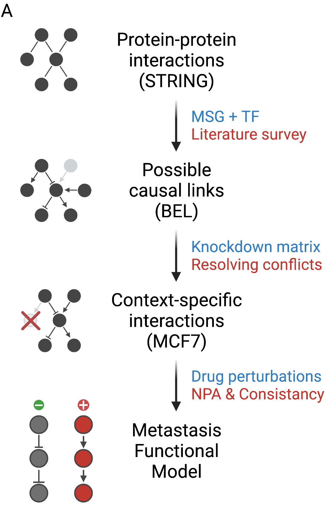

```{r setup, include=FALSE}
knitr::opts_chunk$set(echo = TRUE, message = FALSE, warning = FALSE)
```

# Overview

Screening for potential cancer therapies using existing large datasets of drug
perturbations requires expertise and resources not available to all. This is 
often a barrier for lab scientists to tap into these valuable resources. To 
address these issues, one can take advantage of prior knowledge especially those
coded in standard formats such as causal biological networks (CBN). Large 
datasets can be converted into appropriate structures, analyzed once and the 
results made freely available in easy-to-use formats. In this three parts 
tutorial, we will give a full description of one large scale analysis of 
using this approach, one case study of building a network of metastasis 
suppressors from scratch, and a walkthrough example code to perform and adapt 
these tools for different use cases

# Recap parts one & two

First, let's recap what we learned from part one and two.

- LINPS: is a database for cancer-cell-specific perturbations of biological 
networks
- The interface is a Shiny app built on top of a database of pre-computed scores
- The gene expression data comes from the LINCS project, and the network models
from the causal biological networks (CBN) project
- The network perturbation amplitude (NPA) methods uses gene expression data to
predict the function of upstream nodes encoded in the causal network model.

Now, what if we want to build a network model of a biological function from 
scratch. The second part part of the workshop have just showed an example of
just that

- First, we identify the collection of gene products to build a layer (backbone)
- We map the interactions between these nodes using existing protein-protein 
interactions data (PPI) and literature research (no way around reading papers)
- Optionally, we can choose to augment these interactions by knocking down the 
genes one at a time and examine their downstream effects
- Then, using this same kind of data, we can identify the downstream targets as
a second layer of the backbone of the initial network
- Once we have this two-layers network and a set of gene expression experiments,
we can calculate the effect of each perturbation on the network, and its 
individual components.

The following figure summarizes this workflow

```{r, echo=FALSE, fig.align='center', out.width="70%", fig.cap="A workflow for building, refining, and evaluating a breast cancer-specific network model of metastasis."}

```

The third part of the workshop, explains the code behind this work.
Admittedly, the code is a bit simplified, but hopefully would be enough to get
you started. You can always go back to the source code of the papers for more.

# Part Three:

Part three of this workshop is a walkthrough the code to achieve the following:

1. Encoding directed interactions into the biological expression language (BEL)
2. Computing the network perturbation amplitudes (NPA)
3. Interpreting and visualizing the output

## The setup

To obtain a copy of the materials including this document, clone the 
[repo](https://github.com/MahShaaban/integrating_knowledge_data) using 
`git clone --recurse-submodules`

```{bash, eval = FALSE}
git clone --recurse-submodules https://github.com/MahShaaban/integrating_knowledge_data
```

We will only be using data and code in the directory `Part_3_code-walkthrough/`.
To run the code chunk by chunk, set the working directory to it using `setwd()`.

```{r setwd, eval=FALSE}
# set working directory
setwd('Part_3_code-walkthrough')
```

The required packaged to run this code are listed below. 

```{r load libraries}
# load libraries
library(readr)   # to read text files
library(dplyr)   # to manipulate data
library(igraph)  # to generate a graph
library(NPA)     # to do everything else
```

Alternatively, you can pull and run the docker image
`mahshaaban/integrating_knowledge_data`.

```{bash, eval = FALSE}
docker pull mahshaaban/integrating_knowledge_data:latest
```

Now we will look at each of the three steps by loading, filtering and reshaping.
Unfortunately, there is a lot of that, since the `NPA` package expects the 
inputs in certain format and data structure. Duplicates and missing values can 
also be a problem.

## 1. Encoding directed interactions into the biological expression language (BEL)

The first dataset we will look at is the `combined_interactions`. We curated
this dataset from known protein-protein interactions and manual literature
search. This will form the first layer (backbone) of the network.

```{r interactions_data}
# interactions data
combined_interactions <- read_csv('data/combined_interactions.csv')
```

Here, we remove the missing values and interactions with only correlations. The
reason is, in this analysis, only clear directed interactions are allowed.

```{r filtering_interactinos}
# filtering out undetermined and correlations
combined_interactions <- filter(
  combined_interactions,
  !is.na(Direction),
  !grepl('Correlation', Interaction)
)
```

Each row in this data.frame is an interaction. The first three columns are the
`Source.Node`, `Target.Node`, and `Direction`. `Direction` takes a value of 1 or
-1 for positive and negative interactions respectively.

The next three columns essentially encode the same information, only this time
using the formal biological language expression (BEL) standard.

```{r str_interactions}
# show the structure of the interactions data.frame
# known interactions
combined_interactions[1:3, 1:3]

# interactions coded in BEL
combined_interactions[1:3, 4:6]
```

The first line here can be read as: the protein encoded by the gene MAPK14 acts
as a kinase that directly inhibit the activity of the protein encoded by CASP8
gene.

The following summarizes the entries in the filtered data.frame. 

```{r interactions_summary}
# number of source nodes
length(unique(combined_interactions$Source.Node))

# number of target nodes
length(unique(combined_interactions$Target.Node))

# intersection
length(
  intersect(
  unique(combined_interactions$Source.Node),
  unique(combined_interactions$Target.Node)
)
)
# types of interactions
unique(combined_interactions$Interaction)
```

There is about
`r length(unique(combined_interactions$Source.Node))` `Source.Node`s and
`r length(unique(combined_interactions$Target.Node))` `Target.Node`s,
with a significant overlap between them. The relation between these nodes are
encoded in the column `Interaction` which takes one of 4 values:

1. "directlyDecreases" 
2. "decreases" 
3. "directlyIncreases"
4. "increases"

The difference between "increases" and "directlyIncreases" is whether there is
evidence of a direct interaction between the subject and object.

```{r interactions_graph}
# selecting needed columns
combined_interactions <- select(
  combined_interactions,
  Source.Node,
  Direction,
  Target.Node
)

# make a graph of interactions
interaction_graph <- select(
  combined_interactions,
  from = Source.Node, # alternatively Subject
  to = Target.Node,   # alternatively Object
  weight = Direction  # alternatively Interaction
)

interaction_graph <- graph.data.frame(
  interaction_graph,
  directed = FALSE
)
```

Here is a very simple  visual of the interactions and the distributions of their degrees.

```{r show_graph, fig.align='center', out.width="70%", fig.cap="Interactions graph and node degrees."}
# calculate the node degree
node_degrees <- degree(interaction_graph)
V(interaction_graph)$size <- node_degrees
V(interaction_graph)$label <- NA

# visualized graph and degree distribution
par(mfrow = c(1, 2))
plot(interaction_graph,
     layout = layout_in_circle(interaction_graph))

hist(node_degrees,
     main = 'Histogram of Node degrees',
     xlab = 'Node degree')
box()
```

The second needed dataset is gene expression of knocking down each of the nodes
in the first layer one at a time and recording the changes in gene expression.
In this case, we used this dataset for two purposes

1. Augment the first layer by including the very large effects of knocking down
each of the nodes on other nodes.
2. Building a second layer of genes whose expression is affected by manipulating
each of the nodes in the backbone.

```{r knockdown_data}
# knockdown differential gene expression data
knockdown_diff_expr <- read_csv('data/knockdown_diff_expr.csv')
```

The dataset is quite long. It consists of the fold-change, `FC`, and p-value,
`PVAL` of knocking down each node, `KD`, on all genes, `ID`. `Type` records
whether the target gene is a transcription factor or a metastatsis suppressor 
gene. Those are the two categories we chose to include in the backbone.

```{r str_knockdowns}
str(knockdown_diff_expr)
```

The following filtering step is basically unavoidable. `NPA` expects no missing
values, no loops and no duplicate terminal targets. Here, we group by target and
gene and select the biggest fold-change. Next, we filter by p-value and 
fold-change. Then we remove all members of the backbone layer from the terminal
layer to avoid loops. Finally, we select and rename the variables to match the 
package expected inputs.

```{r filtering_knockdown_data}
# remove nodes that change with more than one kd condition
knockdown_diff_expr <- knockdown_diff_expr %>%
  group_by(KD, ID) %>%
  top_n(n=1, abs(FC)) %>%
  ungroup() 

# remove nodes with pval > .01 and abs fold-change < .5
knockdown_diff_expr <- filter(
  knockdown_diff_expr,
  PVAL < .01 & abs(FC) > .5
) 

# remove nodes in the functional layer
knockdown_diff_expr <- filter(
  knockdown_diff_expr,
  !ID %in% unique(unlist(combined_interactions))
)

# selecting needed columns
knockdown_diff_expr <- select(
  knockdown_diff_expr,
  Source.Node = KD,
  Direction = FC,
  Target.Node = ID
) 

# discretize and reverse the direction of fold-change
knockdown_diff_expr <- mutate(
  knockdown_diff_expr,
  Direction = ifelse(Direction > 0, -1, 1),
  nodeLabel = paste0('EXP(', Target.Node, ')')
)
```

Here we show that there is variability in the effect of knocking down some of 
these nodes on the expression of other genes. This is expected given the fact
that many of the nodes are transcription factors and co-factor.

```{r summarize_knockdowns, fig.align='center', out.width="70%", fig.cap="The number of significantly changed downstream targets."}
# tabulate the nodes by direction of change
tab <- with(knockdown_diff_expr, table(Direction, Source.Node))

# plot the number of targets
par(mfrow = c(1, 1))
barplot(tab[1,] * -1,
        ylim = c(-max(tab), max(tab)),
        las = 2,
        ylab = 'Number of downstream targets',
     main = 'Downstream target of knockdowns')
barplot(tab[2,], add = TRUE, xaxt = 'n', yaxt = 'n')
box()
```

Finally, we need to split this data.frame into a list, with an item for each 
node in the backbone layer, `Source.Node`

```{r list_by_source}
# split by source 
knockdown_diff_expr <- split(
  knockdown_diff_expr[, -1],
  knockdown_diff_expr$Source.Node,
  drop = TRUE
)
```

The first two items of the list look like so

```{r str_list}
# show the structure of the list
str(knockdown_diff_expr[1:2])
```

Now we need to fit these objects in the data structure expect by `NPA`.
We follow the naming convention of `NPA` and its companion `NPAModels`. the name
`Hs__CFA__Metastasis__0__0__1` lists the species, functional category, function,
and a version number.

The object itself is a `list` of length 3. The first of which is also a `list`
named `model` in it we add the data.frame of `edges` or the backbone layer and
the `startNodeDown`; a `list` of data.frames of the terminal layer. Finally, the
`g` is the `igraph` object we built before.

```{r make_network_model}
# make model list
Hs__CFA__Metastasis__0__0__1 <- list()
Hs__CFA__Metastasis__0__0__1$model <- list()
Hs__CFA__Metastasis__0__0__1$model$edges <- as.data.frame(combined_interactions)
Hs__CFA__Metastasis__0__0__1$startNodeDown <- knockdown_diff_expr 
Hs__CFA__Metastasis__0__0__1$g <- interaction_graph
```

And here how it looks

```{r str_model}
# show the structure of the models
str(Hs__CFA__Metastasis__0__0__1, max.level = 1)
str(Hs__CFA__Metastasis__0__0__1, max.level = 3)
```

Saving and loading this model into `NPAModels` is a bit cumbersome. Our 
workaround this is to save the object as an `rda` inside the `data/` directory
and re-install the package locally.

To speed up this step, I removed the existing models in `NPAModel`, so we will 
only be working with the one we constructed from scratch.

```{r save_network_model,eval=FALSE}
# remove the model if saved before
unlink('pkgs/NPAModels/data/Hs__CFA__Metastasis__0__0__1.rda')

# save the model in data/
save(Hs__CFA__Metastasis__0__0__1, file = 'pkgs/NPAModels/data/Hs__CFA__Metastasis__0__0__1.rda')

# re-install the package
devtools::install('pkgs/NPAModels/')
```

## 2. Computing the network perturbation amplitudes (NPA)

The rest of the workflow is straight forward. It includes

1. Pre-processing the networks in `NPAModels/data`
2. Loading the target model
3. Calling `compute_npa()` with the treatment data

We turn to these steps in order.

First, we call `NPAModels::preprocessNetworks()`. It takes
a minute or two to finish.

```{r preprocess_model,eval=FALSE}
# preprocess the network model
NPAModels::preprocessNetworks() # Only need to do it once
```

Then we load and inspect the network model

```{r load_model}
# load the network model
metastasis_model <- NPAModels::load_model('Hs', 'CFA', 'Metastasis')
metastasis_model
```

The sample treatment data we are using here comes form the LINCS project.
MCF7 cell line was treated with chemical compounds and their gene expression 
measured.

```{r treatment_data}
# load treatment data
treatment_diff_expr <- read_csv('data/treatment_diff_expr.csv')
```

The table includes the standard `LIMMA` output for each of the five drugs.

```{r str_treatment}
# show the structure of the treatment data
str(treatment_diff_expr)

unique(treatment_diff_expr$treatment)
```

The effect of these drugs differs in terms of the genes they affect. Here I show
the total number of differentially expressed genes and visualize that of 
cisplatin as an example.

```{r example, fig.align='center', out.width="70%", fig.cap="The number of differentially expressed genes and cisplatin example (volcano plot)"}
par(mfrow = c(1, 2))
# show the numbers of differentially expressed genes
ind <- with(treatment_diff_expr, abs(logFC) > 1 & P.Value < .05)
with(treatment_diff_expr[ind,],
     barplot(table(treatment),
             las = 2,
             ylab = 'Number of genes',
             main = 'Differential expression \n in response to perturbations'))
box()

# show differential expression of cisplatin
with(treatment_diff_expr,
     plot(logFC[treatment == 'cisplatin'],
          -log10(P.Value[treatment == 'cisplatin']),
          xlab = 'Fold-change (log_2)',
          ylab = 'P-value (-log_10)',
          main = 'Differential expression\n (Cisplatin)'))

abline(v = c(-1, 1), col = 'red', lty = 2)
abline(h = -log10(.05), col = 'red', lty = 2)
```

Again, `NPA` expects a `list` of data.frames for each treatment. Each data.frame
consists of `nodeLabel` of the target, a statistics `t` and a `foldChange`. We 
also need to make sure there is no duplicates in the data.frame entries.

```{r filter_treatment_data}
# select needed columns
treatment_diff_expr <- select(
  as.data.frame(treatment_diff_expr),
  treatment,
  nodeLabel = ID,
  t,
  foldChange = logFC
)

# make a list with an item for each drug
treatment_diff_expr <- split(
  treatment_diff_expr[, -1],
  treatment_diff_expr$treatment,
  drop = TRUE
)

# remove duplicates
treatment_diff_expr <- lapply(
  treatment_diff_expr,
  function(x) x[!duplicated(x$nodeLabel),]
)
```

`compute_npa()` takes as an input the `list` of data.frame and the model.

```{r score_model}
# score the metastasis network
npa_metastasis <- compute_npa(
  treatment_diff_expr,
  metastasis_model,
  verbose = TRUE
)
```

The returned object is an "R6" object of class `NPA`. We explore this object in
detail next.

```{r return}
# return object
npa_metastasis
class(npa_metastasis)
```

## 3. Interpreting and visualizing the output

Here is how the output looks like

```{r output_summary}
# show the object structure
str(npa_metastasis)

# show the object summary
summary(npa_metastasis)
```

The package terminology

1. The differential node values are determined by fitting procedures inferring 
the values best satisfy the directionality of the causal relationships contained
in the network model (e.g. positive or negative signs).
2. NPA scores are the sum of the differential values of the nodes in the network.
3. Companion statistics: 
    - P-value
    - O, experimental variation
    - K statistics
4. Leading Nodes are the ones that contribute the most to the aggregate score.

The `NPA` package provide convenient functions to access and visualize the 
output. For example, calling `coefficients()` and `conf.int()` directly on the
object returns the aggregate NPA score and the 95% confidence interval.

```{r extract_coeffs}
# coefficients
coefficients(npa_metastasis)

# confidence intervals
conf.int(npa_metastasis)
```

These can be visually inspected using `barplot`

```{r plot_coeffs, fig.align='center', out.width="70%", fig.cap="Network perturbation amplitudes of five drugs"}
# plot using the built in functions
barplot(npa_metastasis)
# barplot(npa_metastasis, type = 2)
```

To extract the leading nodes, call `as.matrix()` on the object with the argument
`type = 'leadingnodes'`

```{r leading_nodes}
# extract leading nodes
lead_nodes <- as.matrix(npa_metastasis, type = 'leadingnodes')
head(lead_nodes)
```

For each treatment, the `lead_nodes` data.frame has a column, with nodes in 
rows. The first entry "01* (-) 35.16%" can be read as, "NR5A2" is the number 1 
ranked node in response to "cisplatin". The activity of the corresponding 
protein of this node is inhibited and it contributes about 35.16% to the total
NPA score.

The top leading nodes can be inspected visually by calling `plot()` on the 
object.

```{r plot_nodes, fig.align='center', out.width="70%", fig.cap="NPA differential values (heatmap)"}
# plot using built in function
plot(npa_metastasis)
```

Here we see which nodes are regulated and in which direction. The color key on 
the right indicated the magnitude of regulation and the 'x' and 'o' indicate
whether the nodes are below the significance threshold, which is set to 0.05 by
default.

# Summary

- Three types of data are required to run this analysis workflow:
    - Directed interactions to form a backbone layer
    - Expression changes in response to manipulating the backbone nodes
    - Treatment effects to be scored as to how they affect this network
- Other than some data filtering and reshaping, two packages are required to run
the entire workflow; `NPA` and `NPAModels`
- The output of the analysis is biologically straight forward to interpret
    - The NPA score indicates the magnitude and direction of perturbation of the
    network function in response to a given treatment.
    - The differential values of the nodes are expected changes in activity in
    response to a given treatment.

# Next

1. LINPS V2
2. More case studies

### Session Info

```{r session_info}
# session info
devtools::session_info()
```
